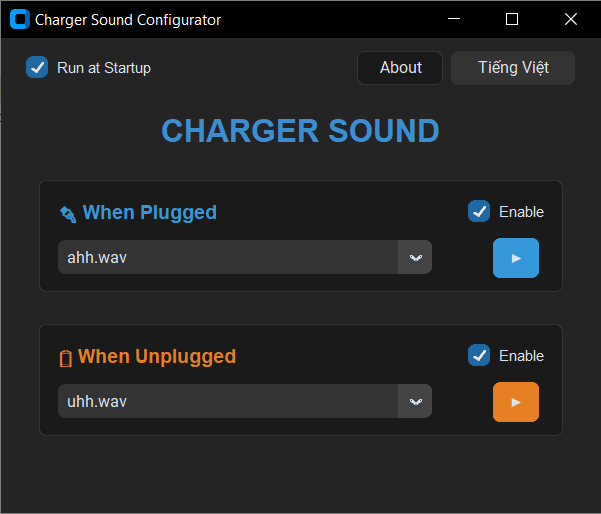

# 🔌 Charger Sound Configurator

Một ứng dụng nhẹ và hiện đại giúp bạn tùy chỉnh âm thanh mỗi khi cắm hoặc rút sạc cho máy tính Windows.



## 🚀 Tải về (Download)

Để bắt đầu sử dụng ngay mà không cần cài đặt Python, bạn hãy tải bản thực thi (.exe) mới nhất tại đây:

👉 **[Tải xuống ChargerSound (.exe) - Phiên bản mới nhất](https://github.com/mhqb365/charger-sound/releases)**

---

## ⚡ Hướng dẫn sử dụng nhanh (Dành cho người dùng)

1.  **Tải ứng dụng**: Tải tệp `ChargerSound.exe` từ link Release phía trên.
2.  **Chuẩn bị âm thanh**: Đảm bảo file `.exe` nằm cạnh thư mục `wav` (thư mục này chứa các tệp âm thanh `.wav` bạn muốn sử dụng).
3.  **Khởi chạy**: Nhấp đúp vào `ChargerSound.exe`.
4.  **Cấu hình**:
    -   Chọn âm thanh cho lúc cắm sạc (🔌) và lúc rút sạc (🔋).
    -   Nhấn nút `▶` để nghe thử.
    -   Tích chọn **Khởi động cùng Windows** nếu bạn muốn ứng dụng tự chạy mỗi khi bật máy.
5.  **Chạy ngầm**: Khi tắt cửa sổ x, ứng dụng sẽ tự động thu nhỏ xuống Khay hệ thống (góc dưới bên phải màn hình). Nhấp chuột phải vào biểu tượng khay để mở lại hoặc thoát hoàn toàn.


## ✨ Tính năng nổi bật

-   🎨 **Giao diện Hiện đại**: Được xây dựng bằng `CustomTkinter` với phong cách Dark Mode chuyên nghiệp.
-   🔊 **Tùy chỉnh Âm thanh**: Dễ dàng thay đổi âm thanh cắm/rút sạc bằng các tệp `.wav` tùy thích.
-   ▶️ **Nghe thử (Preview)**: Tích hợp nút Play để kiểm tra âm thanh ngay lập tức.
-   🌐 **Đa ngôn ngữ**: Hỗ trợ đầy đủ tiếng Anh (English) và tiếng Việt.
-   📥 **Chế độ khay hệ thống (Tray Icon)**: Thu nhỏ ứng dụng xuống góc màn hình để chạy ngầm tiết kiệm diện tích.
-   🚀 **Khởi động cùng Windows**: Tự động chạy ứng dụng khi bật máy để luôn sẵn sàng phục vụ.
-   ⚙️ **Tự động lưu**: Mọi thay đổi của bạn sẽ được tự động lưu vào tệp `settings.json`.

## 🛠️ Hướng dẫn cài đặt (Dành cho nhà phát triển)

1.  **Clone dự án**:
    ```bash
    git clone https://github.com/mhqb365/charger-sound.git
    cd charger-sound
    ```

2.  **Cài đặt thư viện**:
    ```bash
    pip install customtkinter Pillow pywin32 pystray
    ```

3.  **Chạy ứng dụng**:
    ```bash
    python charger-sound.py
    ```

## 📦 Hướng dẫn đóng gói (Build .exe)

Bạn có thể tạo một file `.exe` duy nhất để sử dụng trên bất kỳ máy tính Windows nào mà không cần cài đặt Python.

### Cách 1: Sử dụng script build (Khuyên dùng)
```powershell
./build.ps1
```

### Cách 2: Chạy lệnh PyInstaller trực tiếp
```powershell
pyinstaller --noconfirm --onefile --windowed --name "ChargerSound" --icon "icon.png" --add-data "icon.png;." --collect-all customtkinter --collect-all pystray charger-sound.py
```

**⚠️ Lưu ý quan trọng sau khi Build:**
-   Copy file `ChargerSound.exe` từ thư mục `dist/` ra ngoài.
-   Đảm bảo thư mục `wav/` (chứa các file âm thanh) nằm cùng thư mục với file `.exe` để ứng dụng tìm thấy tệp.

## 📂 Cấu trúc dự án

-   `charger-sound.py`: Mã nguồn chính xử lý GUI và logic lắng nghe nguồn điện.
-   `wav/`: Nơi chứa các tệp âm thanh định dạng `.wav`.
-   `settings.json`: Tệp cấu hình lưu trữ lựa chọn của người dùng.
-   `icon.png`: Biểu tượng của ứng dụng.

## 📝 Giấy phép
Dự án được phát triển nhằm mục đích cá nhân và chia sẻ cộng đồng. Vui lòng ghi nguồn khi sử dụng.
